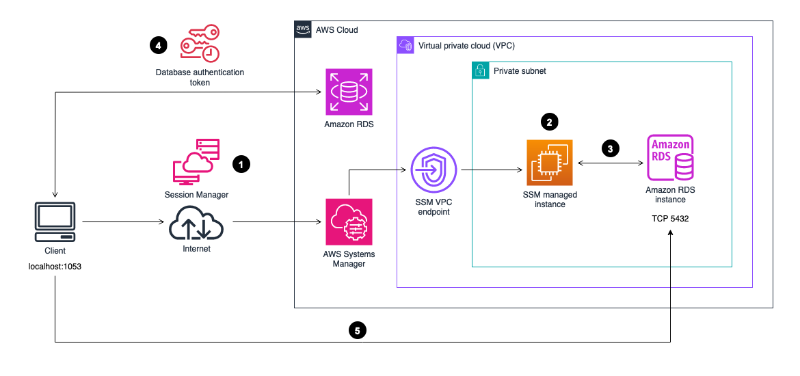

# How to connect local Express server to DB on RDS

## Guide

Follow the steps starting in **"Initial Setup"** in this guide: https://aws.amazon.com/blogs/database/securely-connect-to-amazon-rds-for-postgresql-with-aws-session-manager-and-iam-authentication/

## Architectural Overview

How to connect to your RDS instance with Session Manager

As a best practice for security at the network level, we recommend launching your RDS instances in private subnets and allow access only from the applications within the same VPC or a different VPC.

In order to allow user access to these restricted resources, it is required to have a bastion host through which the users connect to access the database. However, granting access to these bastion hosts sometimes requires exposing them directly to the internet, as they need to be placed on a public subnet, or complex network topologies so that the traffic can be routed from on premises, using services like AWS Direct Connect or a VPN.

Session Manager with remote port forwarding removes the need for a direct connection to the bastion host or to the database, while keeping the security aspects intact.
The following diagram explains the components involved in the architecture and the necessary steps to establish the connection.
The different stages of the workflow are as follows:

1. Start a Session Manager session to one of the Amazon Elastic Compute Cloud (Amazon EC2) Systems Manager managed instances by using the `AWS-StartPortForwardingSessionToRemoteHost` Systems Manager document and the AWS credentials owned by the user.
2. The SSM agent running on the SSM managed instances processes the user’s request from Systems Manager. That communication is possible via the SSM VPC endpoints configured for that purpose.
3. The port forwarding is established and the user can now open a new terminal and send any commands to the remote host through the established tunnel.
4. The user calls Amazon RDS to generate a database authentication token using its IAM credentials.
5. The user connects to the database through the tunnel using the database authentication token previously generated by Amazon RDS.
